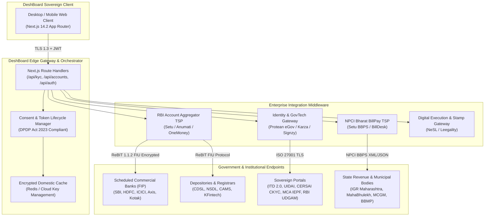

# DeshBoard: Master Production API Integration Architecture
**Document:** System Integration Blueprint & Real-World API Specification  
**Classification:** Enterprise Engineering & Executive Presentation  
**Target Architecture:** Production NRI Wealth Command Center (Real Data Ingestion)  
**Date:** September 2026  

---

## 1. Executive Summary & Integration Architecture

DeshBoard aggregates and automates the management of Indian assets for Non-Resident Indians (NRIs) across the **United States (Silicon Valley)**, **United Kingdom (London)**, and the **United Arab Emirates (Dubai)**. 

To replace simulated demo ledgers with **real-world financial and statutory data**, DeshBoard operates as an institutional **Financial Information User (FIU)**, **Application User Agency (AUA)**, and **Registered Business Partner** interfaced with sovereign Indian regulators:
- **Reserve Bank of India (RBI)**: Account Aggregator (NBFC-AA) ecosystem & UDGAM unclaimed deposits.
- **Income Tax Department (ITD 2.0) & Protean/NSDL**: PAN status, Annual Information Statements (AIS), 26AS, Form 15CA/CB.
- **Securities and Exchange Board of India (SEBI)**: CDSL, NSDL, CAMS, and KFintech CAS registries.
- **Unique Identification Authority of India (UIDAI)**: Certified Aadhaar e-KYC & XML domicile address decryption.
- **Ministry of Corporate Affairs (MCA)**: IEPF-5 unclaimed dividend and share recovery.
- **Inspector General of Registration (IGR) & Municipalities**: State land title extracts (Index-II), 7/12 Mahabhulekh, and municipal property tax via NPCI Bharat BillPay (BBPS).

### Enterprise Integration Topology



---

## 2. Master Feature-to-API Mapping Matrix

| # | Portal Feature / Module | Business Functionality | Primary Government / Regulated Entity | Production API / Provider Gateway | Protocol & Standard |
| :-: | :--- | :--- | :--- | :--- | :--- |
| **01** | **Tax Residency & Jurisdiction** | Cross-border tax treaty validation (US IRS FATCA, UAE Zero DTT, UK Worldwide Remittance) | Central Board of Direct Taxes (CBDT) & US IRS | **Protean Tax Residency API / Clear Tax Compliance API** | HTTPS / REST JSON |
| **02** | **PAN Statutory Verification** | 10-digit PAN validation, name/father match, Aadhaar seeding, active NRI classification | Income Tax Dept (ITD 2.0) via Protean (NSDL) / UTIITSL | **Protean eGov TIN PAN API** / **Setu PAN Verification API** | RESTful JSON, HMAC-SHA256 |
| **03** | **Central KYC (CKYCR) Query** | 14-digit KIN lookup, retrieval of 7+ mapped regulated financial institutions | CERSAI (Central Registry of Securitisation) | **CERSAI CKYC Gateway** via **Karza (Perfios) / Signzy CKYC API** | SOAP / XML over HTTPS with PKI Signature |
| **04** | **Aadhaar e-KYC 2.1** | 6-digit OTP challenge, address decryption, biometric verification token | UIDAI (Unique Identification Authority of India) | **UIDAI e-KYC 2.1 Gateway** via licensed **AUA/KUA (Protean / Signzy / Setu)** | Encrypted XML, 2048-bit RSA, SHA-256 |
| **05** | **Bank Accounts (NRE / NRO / FCNR)** | Real-time balances, accrued interest, term deposits, and statement streaming | Scheduled Commercial Banks (SBI, HDFC, ICICI, Axis, BoB, Kotak) | **RBI Account Aggregator (AA) Framework** via **Setu FIU / Anumati AA** | ReBIT FIU Schema v1.1.2 (E2E Elliptic Curve DHE) |
| **06** | **Bank Redesignation & Video KYC** | Changing resident savings accounts to NRO/NRE, remote in-person verification (V-CIP) | RBI Banking Regulation & Scheduled Commercial Banks | **Bank Open Banking Developer APIs** (HDFC / ICICI) + **HyperVerge / Signzy V-CIP Engine** | WebRTC Video + Face Match AI + GPS Geotagging |
| **07** | **Real Estate Title Verification** | Index-II extract verification, ownership chain, encumbrance check | Inspector General of Registration (IGR Maharashtra, Kaveri 2.0 Karnataka) | **IGR Maharashtra e-Search Portal API** / **Landeed Pan-India Property API** | REST API with CAPTCHA Bypass & OCR Parsing |
| **08** | **Land Records & Mutations** | Agricultural land 7/12 Satbara, 8A extract, mutation (Ferfar) dispute tracking | State Revenue Departments (e-Mahabhumi / MahaBhulekh) | **MahaBhulekh AnyRoR API** / **TerraDo Land Record Engine** | REST JSON with Land Parcel GID |
| **09** | **Municipal Property Tax** | Assessment ledger, overdue municipal tax, online receipt generation | Municipal Corporations (MCGM Mumbai, BBMP Bengaluru) | **NPCI Bharat BillPay (BBPS)** via **Setu BBPS API** / **BillDesk BBPS** | ISO 8583 / BBPS REST API (Biller: `Property Tax`) |
| **10** | **Utility Bill Management** | Live bill fetch & auto-reconciliation for Adani Electricity, MGL Gas, etc. | Utility Providers (Adani Electricity, Mahanagar Gas) | **NPCI Bharat BillPay (BBPS)** (`ADAN00000MUM01`, `MAHA00000MAH01`) | BBPS Biller Fetch & Payment Protocol |
| **11** | **CDSL & NSDL Demat Stocks** | ISIN-level equity holdings, portfolio market value, depository pledge status | CDSL & NSDL (Depositories) | **RBI Account Aggregator (`FI_TYPE: EQUITIES`)** + **CDSL Easiest / NSDL IDeAS OpenAPI** | ReBIT Equity Schema v1.1.2 |
| **12** | **Mutual Fund Folios** | Consolidated portfolio NAVs, dividend reinvestment, active SIP schedules | AMFI (Association of Mutual Funds in India), CAMS, KFintech | **MFCentral OpenAPI** / **CAMS & KFintech Account Aggregator (`FI_TYPE: MUTUAL_FUNDS`)** | RESTful JSON API with CAS Token |
| **13** | **Sovereign Gold Bonds (SGB) & G-Secs**| RBI SGB tranches, interest payout schedules, redemption maturity tracking | Reserve Bank of India (RBI) | **RBI Retail Direct G-Sec API** / **Depository CAS Feed** | Financial API with Digital Certs |
| **14** | **Digital Gold (MMTC-PAMP)** | Vaulted 24K 999.9 gold grams, live liquidation rate, bullion delivery | MMTC-PAMP / SafeGold | **MMTC-PAMP B2B Partner API** / **SafeGold REST API** | REST JSON with OAuth 2.0 Bearer |
| **15** | **EPFO Employee Provident Fund** | Universal Account Number (UAN) passbook, employer/employee balance, pension fund | EPFO (Ministry of Labour & Employment) | **EPFO Unified Member Portal API** via **Karza / Surepass / Setu EPF API** | HTTPS REST API with Captcha Solver & OTP Challenge |
| **16** | **National Pension System (NPS)** | PRAN Tier-I and Tier-II ledgers, asset allocation (Equity/Corporate/Govt) | PFRDA & Protean CRA / KFintech CRA | **Protean CRA OpenAPI** / **Account Aggregator (`FI_TYPE: NPS`)** | ReBIT NPS Protocol |
| **17** | **Insurance Portfolio (Life & Health)**| Sum assured, annual premium due date, surrender value, nomination registry | IRDAI, Insurance Repositories (CAMSRep, NDML NIR, CIRL) | **IRDAI Insurance Repositories (CAMSRep / NDML API)** / **Account Aggregator (`FI_TYPE: INSURANCE_POLICIES`)** | ReBIT Insurance Schema v1.1.2 |
| **18** | **Cross-Border Tax & DTAA Relief** | AIS/TIS annual transactions, Form 26AS TDS tax credits, Section 195 withholding | Income Tax Department (ITD 2.0) | **ClearTax (Clear) Developer API** / **Quicko Tax Cloud API** | REST API with E-Filing 2.0 Client Tokens |
| **19** | **US IRS FBAR & FATCA Automation** | Peak calendar-year foreign balance calculation, Form 114 CSV generation | US Department of the Treasury (FinCEN) & IRS | **FinCEN BSA E-Filing Batch XML/CSV API** via Authorized IRS Transmitter | FinCEN Electronic Filing Specification (EFS) |
| **20** | **FEMA Outward Remittance (15CA/CB)**| Outward capital repatriation ($1M USD/yr), digital CA certification, Form 15CA | Central Board of Direct Taxes (CBDT) & AD Category-I Banks | **ITD Form 15CA e-Filing API** + **ICICI / HDFC Outward Remittance API** | REST JSON with Digital CA DSC Signature |
| **21** | **Mortgages & Debt Amortization** | Principal balance, floating interest rate, Section 24(b) interest certificate | Lending Banks & NBFCs (HDFC Home Loans, SBI) | **TransUnion CIBIL CIR API** + **Bank Retail Loan Servicing APIs** | ISO 20022 Financial Messaging / REST JSON |
| **22** | **Digital Indian Will & Succession** | Legally binding Will drafting, e-Stamping, NeSL digital execution, probate rules | State Governments & NeSL (National E-Governance Services Ltd) | **NeSL Digital Document Execution (DDE) API** + **Leegality / Protean e-Sign API** | Indian IT Act 2000 Section 3A, PKI Token |
| **23** | **Unclaimed Dividend (IEPF-5)** | Tracing unpaid corporate dividends & shares transferred to IEPF authority | Ministry of Corporate Affairs (MCA21 v3) | **MCA IEPF-5 Web API** / **Surepass Corporate IEPF Tracker API** | REST JSON with PAN/Folio Search |
| **24** | **Unclaimed Bank Balances (UDGAM)** | Discovering dormant bank accounts across 30+ scheduled commercial banks | Reserve Bank of India (RBI UDGAM Gateway) | **RBI UDGAM Gateway API** / **Fintech Search RPA Bridge** | Encrypted HTTPS with OTP verification |
| **25** | **DeshBoard AI Intelligence Engine**| Statutory counsel on FEMA, DTAA Articles, capital gains, and probate | DeshBoard Rule Matrix & Legal Corpus | **Google Gemini 1.5 Pro API** (Grounded with statutory tax & legal corpora) | REST JSON Streaming |
| **26** | **Live Multi-Currency (INR / USD)** | Real-time dual-currency portfolio conversion against official rates | Financial Markets & Reserve Bank of India | **Open Exchange Rates API** / **RBI Daily Reference Rate API** | High-availability JSON REST |

---

## 3. Deep-Dive Integration Specifications by Feature

### 3.1. Identity, PAN & Central KYC (Onboarding Pipeline)

#### Feature Overview
During Onboarding Step 1 & 2, the NRI user inputs their 10-digit Indian PAN (`ABCPM1234D`). The system validates statutory tax status, determines if the PAN is operative, checks Aadhaar linking status, and queries the Central KYC Records Registry (CERSAI) to extract existing linked accounts.

#### Primary Government Authority
- **Central Board of Direct Taxes (CBDT)** & **Income Tax Department (ITD 2.0)**
- **CERSAI (Central Registry of Securitisation Asset Reconstruction and Security Interest of India)**

#### Production API Gateway
- **Primary**: **Protean eGov Technologies (NSDL TIN PAN Verification API)** (`https://www.tin-nsdl.com/`)
- **Enterprise Middleware**: **Setu PAN Verification API** (`https://docs.setu.co/identity/pan`) or **Karza (Perfios) PAN 2.0 API**
- **CKYC Gateway**: **Karza / Signzy CKYC Search & Download API** (`https://docs.signzy.com/`)

#### Technical Endpoint Specification
```http
POST https://api.setu.co/api/verify/pan
Headers:
  x-client-id: {SETU_CLIENT_ID}
  x-client-secret: {SETU_CLIENT_SECRET}
  Content-Type: application/json

Payload:
{
  "pan": "ABCPM1234D",
  "consent": "Y",
  "reason": "NRI Sovereign Wealth Aggregation"
}

Response (200 OK):
{
  "status": "success",
  "data": {
    "pan": "ABCPM1234D",
    "name": "BRIJAL RAMESHCHANDRA PATEL",
    "father_name": "RAMESHCHANDRA PATEL",
    "dob": "18/10/1984",
    "status": "OPERATIVE",
    "aadhaar_seeding_status": "LINKED",
    "category": "INDIVIDUAL",
    "last_updated": "2026-08-15"
  }
}
```

```http
POST https://api.karza.in/v3/ckyc/search
Payload:
{
  "pan": "ABCPM1234D",
  "dob": "18-10-1984"
}

Response (200 OK):
{
  "kin": "40029104928104",
  "kyc_status": "VERIFIED",
  "mapped_financial_institutions_count": 7,
  "last_kyc_date": "2024-03-12"
}
```

---

### 3.2. Aadhaar e-KYC & Certified Domicile Address Decryption

#### Feature Overview
In Onboarding Step 3, the user enters their 12-digit Aadhaar / Virtual ID (VID). A cryptographic OTP challenge is issued to their Aadhaar-linked mobile phone. Verification returns an official XML payload digitally signed by UIDAI, containing the certified Indian domicile address required by scheduled commercial banks for NRO/NRE operations.

#### Primary Government Authority
- **UIDAI (Unique Identification Authority of India)**

#### Production API Gateway
- **Authorized AUA/KUA Provider**: **Protean eGov AUA Gateway** or **Setu Aadhaar e-KYC API** (`https://docs.setu.co/identity/aadhaar`)

#### Technical Endpoint Specification
```http
# Step 1: Initiate Challenge
POST https://api.setu.co/api/okyc
{
  "aadhaar_number": "XXXXXXXX4521",
  "consent": "Y"
}
# Step 2: Validate OTP & Decrypt Address
POST https://api.setu.co/api/okyc/verify
{
  "request_id": "req_setu_901829",
  "otp": "452109"
}

Response (200 OK):
{
  "status": "SUCCESS",
  "data": {
    "full_name": "Brijal Patel",
    "care_of": "S/O Rameshchandra Patel",
    "address": {
      "flat": "Flat 4B, Oberoi Woods",
      "street": "Mohan Gokhale Road",
      "locality": "Goregaon East",
      "city": "Mumbai",
      "district": "Mumbai Suburban",
      "state": "Maharashtra",
      "pincode": "400063",
      "country": "India"
    },
    "signature_verified": true,
    "signer": "UIDAI Sovereign Root CA 2026"
  }
}
```

---

### 3.3. Bank Accounts (NRE, NRO, FCNR & Fixed Deposits)

#### Feature Overview
Consolidates all Indian banking relationships (HDFC, SBI, ICICI, Axis, Kotak, Bank of Baroda). Monitors live liquid balances, fixed deposits, foreign currency deposits (FCNR-B in USD), and flags accounts overdue for mandatory NRI re-KYC.

#### Primary Government / Regulated Authority
- **Reserve Bank of India (RBI)** under the **Account Aggregator (NBFC-AA) Master Directions (2016)**.

#### Production API Gateway
- DeshBoard operates as an **FIU (Financial Information User)** connected via:
  - **Setu AA Engine (Pine Labs)** (`https://setu.co/account-aggregator`)
  - **Anumati (Perfios AA)** (`https://anumati.co.in/`)
  - **Finvu (Cookiejar Technologies)** (`https://finvu.in/`)

#### Technical Protocol & Flow
1. **Consent Creation**: DeshBoard initiates a digitally signed consent request via the Account Aggregator TSP specifying `FI_TYPES: ["DEPOSIT", "TERM_DEPOSIT", "RECURRING_DEPOSIT"]`.
2. **User Authorization**: The user receives an SMS/Notification to approve the consent on their registered AA handle (e.g., `brijal@setu`).
3. **Encrypted Ingestion**: The bank (Financial Information Provider - FIP) encrypts the financial payload with an ephemeral Diffie-Hellman key generated by DeshBoard. The payload is streamed and decrypted client-side.

```http
POST https://aa-api.setu.co/v1/consent
{
  "consent_detail": {
    "consent_type": "PERIODIC",
    "fetch_type": "PERIODIC",
    "consent_mode": "VIEW",
    "fi_types": ["DEPOSIT", "TERM_DEPOSIT"],
    "data_life": { "unit": "MONTH", "value": 12 },
    "frequency": { "unit": "DAY", "value": 1 },
    "data_filter": [{ "type": "TRANSACTION_AMOUNT", "operator": ">=", "value": "0" }]
  }
}
```
- **Standard**: **ReBIT Financial Information User Schema v1.1.2**.
- **Data Ingested**: Account Number (Masked), Balance, Available Amount, Account Type (`NRE`, `NRO`, `FCNR`), Current Interest Rate, Maturity Date of Fixed Deposits, Lien Status.

---

### 3.4. Account Redesignation & Remote Video KYC (V-CIP)

#### Feature Overview
Under FEMA Section 6 regulations, an Indian resident who moves abroad must redesignate their regular savings accounts into NRO (Non-Resident Ordinary) status. The portal provides one-click digital redesignation and embedded remote Video KYC (V-CIP) with partner banks.

#### Primary Regulated Authority
- **Reserve Bank of India (RBI)**: **Master Direction on KYC - Section 18 (V-CIP)**.

#### Production API Gateway
- **Bank Corporate Open APIs**:
  - **HDFC Bank Open Banking (Retail Account Servicing API)** (`https://developer.hdfcbank.com/`)
  - **ICICI Bank Developer Portal (Account Services API)** (`https://developer.icicibank.com/`)
- **V-CIP Video KYC Infrastructure**:
  - **Signzy Video KYC API** (`https://signzy.com/video-kyc/`)
  - **HyperVerge Video KYC Suite** (`https://hyperverge.co/solutions/video-kyc/`)

#### Technical Specification
- **Capabilities**: Automated concurrent face-match between live stream and Aadhaar/PAN photo, optical character recognition (OCR) of physical PAN card shown on camera, live GPS coordinates validation (ensuring audit logs record connection origin e.g. San Jose / Dubai), audio-visual recording archiving for 10 years per RBI compliance.

---

### 3.5. Real Estate, Land Records & Municipal Liabilities

#### Feature Overview
Tracks Indian real estate assets:
1. **Flat 4B, Oberoi Woods, Goregaon East, Mumbai** (Valuation: ₹1.47 Cr, Index-II Verified, MCGM Property Tax Due: ₹14,200).
2. **Nagpur Farmland Parcel, Kalmeshwar** (Valuation: ₹35L, 7/12 Mahabhulekh Extract, Mutation Dispute Flagged).

#### Primary Government Authorities
- **IGR Maharashtra (Inspector General of Registration & Stamps)**
- **Revenue Department, Government of Maharashtra (MahaBhulekh / e-Mahabhumi)**
- **Brihanmumbai Municipal Corporation (MCGM / BMC)** & **BBMP Bengaluru**
- **NPCI Bharat BillPay (BBPS)**

#### Production API Gateways
1. **Property Index-II & Encumbrance**:
   - **Primary**: **IGR Maharashtra SARITA e-Search API** (`https://esearchigr.maharashtra.gov.in/`)
   - **PropTech Aggregator**: **Landeed Pan-India Property Search API** (`https://www.landeed.com/`)
   - **Returns**: Registration Year, Document Number, Volume/Page, Market Value, Carpet Area, Index-II PDF.
2. **Land 7/12 & Mutation (Ferfar)**:
   - **MahaBhulekh AnyRoR API** (`https://bhulekh.mahabhumi.gov.in/`) via **TerraDo Land API**
   - **Returns**: District, Taluka, Village, Survey Number / Gat Number, Cultivable Area, Name of Khatedar, Mutation entry (Form 6) pending litigation flags.
3. **Municipal Property Tax & Utilities**:
   - **NPCI Bharat BillPay (BBPS)** via **Setu BBPS API** / **BillDesk BBPS Connect**
   - **Biller IDs**:
     - MCGM Property Tax: `MCGM00000MUM01`
     - Adani Electricity Mumbai: `ADAN00000MUM01`
     - Mahanagar Gas Limited (MGL): `MAHA00000MAH01`
   - **Specification**: BBPS Fetch & Pay Request returns exact live billing demand, penalty interest, bill cycle date, and instant confirmation receipt.

---

### 3.6. Stocks, Demat Portfolios & Mutual Funds

#### Feature Overview
Consolidates Indian capital market investments across CDSL/NSDL Demat folios (4 Equities: Reliance, Infosys, TCS, HDFC Bank) and mutual fund holdings (3 Folios across HDFC Mutual Fund, Parag Parikh Flexi Cap, SBI Bluechip).

#### Primary Government / Regulated Authority
- **Securities and Exchange Board of India (SEBI)**

#### Production API Gateway
1. **Demat Equity Holdings**:
   - **RBI Account Aggregator (`FI_TYPE: EQUITIES`)**:
     - Both **CDSL** and **NSDL** operate as registered Financial Information Providers (FIPs) on the Account Aggregator network.
     - Fetches demat account number, depository participant (DP) ID, ISIN codes, company name, settled units, and locked-in units.
   - **Direct Depository API**: **CDSL Easiest OpenAPI** / **NSDL IDeAS Gateway**.
2. **Mutual Fund Folios**:
   - **MFCentral OpenAPI** (`https://developer.mfcentral.com/`): Unified digital platform created by **CAMS** and **KFintech** under SEBI direction.
   - **Account Aggregator (`FI_TYPE: MUTUAL_FUNDS`)**:
     - Provides folio-level NAVs, unit balances, SIP mandate schedules, Folio KYC compliance flags, and capital gains statements.

---

### 3.7. Sovereign Gold Bonds, Government Bonds & Alternates

#### Feature Overview
Tracks non-equity alternate wealth:
1. Sovereign Gold Bonds (SGB 2021-22 Series V) with semi-annual 2.5% p.a. sovereign interest.
2. RBI Floating Rate Savings Bonds (FRSB 2024).
3. Vaulted Digital Gold via MMTC-PAMP.

#### Production API Gateway
- **RBI Retail Direct API** (`https://rbiretaildirect.org.in/`): Interfaced with the Reserve Bank of India’s core banking system (e-Kuber) for G-Secs, SGBs, and Treasury Bills.
- **MMTC-PAMP B2B Partner API** (`https://www.mmtcpamp.com/`): Live gold vault balance, purity audit certificates, spot buy/sell valuation feed.

---

### 3.8. Retirement, EPFO Provident Fund & NPS

#### Feature Overview
Consolidates retirement accounts accrued during previous employment in India:
- **EPFO EPF**: ₹4,82,000 balance across UAN `100928192847`.
- **NPS (National Pension System)**: ₹9,40,000 balance across PRAN `110029481920`.
- **Public Provident Fund (PPF)**: ₹3,88,900 at State Bank of India.

#### Production API Gateways
1. **EPFO Provident Fund**:
   - **Provider**: **Karza EPFO Passbook API (Perfios)** / **Setu EPF API**
   - **Endpoint**:
     ```http
     POST https://api.karza.in/v3/epfo/fetch-passbook
     {
       "uan": "100928192847",
       "mobile": "9819204910",
       "otp": "902184"
     }
     ```
   - **Returns**: Full historical passbook ledger, employer contribution, employee contribution, pension fund balance, transfer history.
2. **NPS (National Pension System)**:
   - **Protean CRA (Central Recordkeeping Agency) OpenAPI** (`https://cra-nsdl.com/`) / **Account Aggregator (`FI_TYPE: NPS`)**.
   - **Returns**: Scheme-wise asset allocation (Equity `E`, Corporate Debt `C`, Government Securities `G`), tier I/II breakdown, accumulated units.
3. **Public Provident Fund (PPF)**:
   - Ingested via **RBI Account Aggregator (`FI_TYPE: PPF`)** through bank FIP.

---

### 3.9. Life & Health Insurance Dematerialization

#### Feature Overview
Tracks 3 active life/term and health policies (HDFC Life Click 2 Protect, LIC Tech Term, Max Life Flexi) totaling ₹4.0 Crore in total cover. Alerts user on upcoming premium dates and verifies nominee designations.

#### Primary Regulated Authority
- **Insurance Regulatory and Development Authority of India (IRDAI)**

#### Production API Gateway
- **IRDAI Approved Insurance Repositories**:
  - **CAMSRep (CAMS Insurance Repository)** (`https://www.camsrepository.com/`)
  - **NDML Insurance Repository (NIR)** (`https://nir.ndml.in/`)
- **Account Aggregator (`FI_TYPE: INSURANCE_POLICIES`)**:
  - Streams policy terms, premium due dates, lapse status, surrender value, and beneficiary allocation.

---

### 3.10. Cross-Border Taxes, DTAA & US IRS FBAR Export

#### Feature Overview
The statutory core for US/UK/UAE NRIs:
1. **Income Tax Department 2.0**: Ingests Annual Information Statement (AIS), Taxpayer Information Summary (TIS), and Form 26AS for Section 195 TDS deductions.
2. **US IRS FBAR Form 114**: Calculates calendar-year peak balances across all Indian accounts; generates formatted CSV for direct FinCEN BSA E-Filing.
3. **US IRS Form 8938 (FATCA)**: Evaluates aggregate foreign asset thresholds ($200,000 for single, $400,000 for married filing jointly abroad).
4. **FEMA Outward Remittance (Form 15CA & 15CB)**: Automates digital Chartered Accountant certification under Rule 37BB for repatriating rental and capital gains income up to $1 Million USD per financial year.

#### Production API Gateways
1. **Indian Tax (ITD 2.0 / AIS / 26AS)**:
   - **ClearTax (Clear) Enterprise Tax Cloud API** (`https://clear.in/enterprise/`)
   - **Quicko Tax Cloud API** (`https://quicko.com/developer/`)
   - **Returns**: Full JSON feed of tax deducted at source (TDS), interest on NRO deposits, mutual fund capital gains distributions, dividend credits.
2. **US IRS / FinCEN FBAR E-Filing**:
   - **FinCEN BSA E-Filing Batch Transmission API** (`https://bsaefiling.fincen.treas.gov/`)
   - **Standard**: Discrete XML / Structured CSV specification for FinCEN Form 114.
3. **FEMA Form 15CA/15CB Gateway**:
   - **ITD E-Filing 2.0 Portal API** with embedded **Digital Signature Certificate (DSC)** bridge for CA verification of withholding tax rates under DTAA Article 10/11.

---

### 3.11. Unclaimed Wealth Recovery (IEPF & RBI UDGAM)

#### Feature Overview
Automatically discovers forgotten, dormant, or unclaimed Indian capital:
1. **MCA IEPF-5 Registry**: Tracing unclaimed corporate dividends (e.g. ₹18,400 in Infosys dividends transferred to IEPF).
2. **RBI UDGAM Gateway**: Identifying inoperative savings and fixed deposit accounts across 30+ banks (e.g. ₹44,000 in dormant Bank of Baroda account).

#### Production API Gateways
1. **MCA IEPF-5**:
   - **Ministry of Corporate Affairs (MCA21 v3) Portal API** (`https://www.iepf.gov.in/`) via **Surepass Corporate IEPF API**.
   - **Query**: Matches user PAN and name against corporate investor education ledgers; returns claim filing entitlement details.
2. **RBI UDGAM**:
   - **RBI UDGAM Portal Gateway API** (`https://udgam.rbi.org.in/`).
   - **Query**: Aggregated identity search through Reserve Bank of India’s centralized DEA Fund registry.

---

### 3.12. Digital Indian Will, Estate Planning & Succession

#### Feature Overview
Enables NRIs to execute an Indian Will legally enforceable under the Indian Succession Act, 1925, complete with digital state e-Stamping, NeSL digital execution, Aadhaar e-Sign, and probate jurisdiction mapping (Bombay High Court).

#### Primary Government Authority
- **NeSL (National E-Governance Services Limited)** - India’s Union Government Information Utility under IBC.
- **State Department of Registration & Stamps**

#### Production API Gateways
1. **NeSL Digital Document Execution (DDE) API** (`https://nesl.co.in/dde/`):
   - Generates digital state stamp duty certificate (e-Stamping) eliminating physical stamp paper.
2. **Aadhaar e-Sign Service Provider (ESP)**:
   - **Leegality API** (`https://www.leegality.com/`) / **Protean e-Sign API**
   - **Standard**: Indian Information Technology Act, 2000 Section 3A. Generates legally valid digital signatures using UIDAI OTP biometric authentication.

---

### 3.13. DeshBoard AI Intelligence Engine (Statutory Counsel)

#### Feature Overview
Contextual statutory copilot analyzing NRI financial inquiries against:
- Indian Income Tax Act, 1961 (Sections 6, 9, 115C-115I, 195, 24b).
- FEMA Remittance of Assets Regulations (2016).
- US-India DTAA (Double Tax Avoidance Agreement) Articles 10 (Dividends), 11 (Interest), 13 (Capital Gains).
- Bombay High Court Probate Rules (Original Jurisdiction).

#### Production AI Infrastructure
- **LLM Engine**: **Google Gemini 1.5 Pro API** (`@google/genai`)
- **Architecture**:
  - Contextual System Prompt embedded with verified statutory acts and bilateral treaties.
  - Zero-shot citation grounding returning formal legal article numbers.
  - Structured JSON schema enforcement for automated client-side recommendation cards.

---

## 4. Enterprise Partner Landscape & Technology Middleware

To implement this architecture in production, DeshBoard partners with certified Tier-1 technology service providers (TSPs) licensed by Indian regulators:

```
┌─────────────────────────────────────────────────────────────────────────────┐
│                       DESHBOARD CORE APPLICATION                            │
└──────────────────────────────────────┬──────────────────────────────────────┘
                                       │
         ┌─────────────────────────────┼─────────────────────────────┐
         ▼                             ▼                             ▼
┌──────────────────┐          ┌──────────────────┐          ┌──────────────────┐
│  SETU / PINE LABS│          │ PROTEAN / NSDL   │          │     LEEGALITY    │
│  • RBI Account   │          │  • PAN Verify    │          │  • NeSL Digital  │
│    Aggregator    │          │  • Aadhaar eKYC  │          │    e-Stamping    │
│  • NPCI BBPS     │          │  • Protean CRA   │          │  • Aadhaar eSign │
│  • Bank Deposit  │          │  • CKYC Gateway  │          │    (IT Act 2000) │
└──────────────────┘          └──────────────────┘          └──────────────────┘
         │                             │                             │
         ▼                             ▼                             ▼
┌──────────────────┐          ┌──────────────────┐          ┌──────────────────┐
│ KARZA / PERFIOS  │          │ CLEARTAX / QUICKO│          │   LANDEED / IGR  │
│  • EPFO Passbook │          │  • ITD 2.0 AIS   │          │  • Index-II Deed │
│  • CERSAI CKYCR  │          │  • 26AS TDS      │          │  • 7/12 Land     │
│  • CIBIL Score   │          │  • Form 15CA/CB  │          │  • Property Tax  │
└──────────────────┘          └──────────────────┘          └──────────────────┘
```

---

## 5. Security, Privacy & Regulatory Compliance Mandates

### 5.1. Zero-Fund-Movement Mandate
- DeshBoard operates strictly as a **Financial Information User (FIU)**.
- Under Section 7 of the RBI Account Aggregator directions, an FIU is legally and architecturally prohibited from storing transactional credentials, initiation tokens, or netbanking passwords.
- No funds can be debited, transferred, or liquidated from the DeshBoard portal.

### 5.2. Digital Personal Data Protection Act, 2023 (India)
- **Consent Lifecycle**: Every API query is preceded by an explicit, purpose-limited electronic consent artifact logged in compliance with DPDP Rule 4.
- **Right to Erasure (One-Click Purge)**: Triggering account deletion invokes cascading purge webhooks across local data stores and notifies partner aggregators to revoke active FIU tokens.

### 5.3. End-to-End Encryption Standards
- **In-Transit**: TLS 1.3 strictly enforced with HSTS (HTTP Strict Transport Security).
- **At-Rest**: AES-256 GCM encryption backed by hardware security modules (Cloud KMS).
- **FIU-FIP Tunneling**: Curve25519 / Elliptic Curve Diffie-Hellman (ECDH) key exchange ensuring Account Aggregator payloads remain encrypted from the bank directly to the client browser.

---

## 6. Phased Implementation & Production Rollout Plan

```
Phase 1: Identity, Banking & Central KYC (Weeks 1 - 4)
├── Finalize Setu Account Aggregator FIU agreement & sandbox onboarding
├── Integrate Protean TIN PAN verification & UIDAI e-KYC 2.1 via Setu Identity
├── Implement ReBIT 1.1.2 financial data decryption engine
└── Replace mock accounts in /api/accounts with live AA data streams

Phase 2: Real Estate, Utilities & Investments (Weeks 5 - 8)
├── Interface NPCI Bharat BillPay (BBPS) for MCGM Property Tax, Adani & MGL bills
├── Deploy Landeed / IGR Maharashtra API for Index-II deed verification
├── Onboard MFCentral API for mutual fund folios & CDSL depository data
└── Integrate EPFO passbook API for retirement synchronization

Phase 3: Cross-Border Tax, FBAR & Digital Will (Weeks 9 - 12)
├── Connect ClearTax / Quicko Cloud API for ITD 2.0 AIS and Form 26AS
├── Implement FinCEN BSA E-Filing Form 114 automated CSV/XML validator
├── Deploy NeSL digital execution & Leegality e-Sign for Indian Will module
└── Connect RBI UDGAM & MCA IEPF scrapers for unclaimed recovery
```

---

## 7. Executive Presentation Cheat-Sheet (Tomorrow's Pitch)

When presenting to stakeholders and investors, use these concise takeaways:

1. **"We do not screen-scrape or ask for banking passwords."**  
   *We integrate through the RBI-licensed Account Aggregator network (Setu/Pine Labs), meaning 100% read-only security with zero transaction liability.*

2. **"We tap into sovereign Indian digital public infrastructure (India Stack)."**  
   *Identity is anchored via Protean (NSDL) and UIDAI; assets are verified through CERSAI, CDSL, NSDL, and state land registries.*

3. **"We automate compliance for both sides of the ocean."**  
   *On the Indian side: Form 26AS, Section 195 TDS, and FEMA Form 15CA/15CB outward remittance. On the foreign side: US IRS FBAR Form 114 and Form 8938.*

4. **"Enterprise Grade & Turnkey."**  
   *By partnering with licensed TSPs like Setu, Protean, and Leegality, our technical architecture is fully compliant with the DPDP Act 2023 and RBI guidelines from Day 1.*
