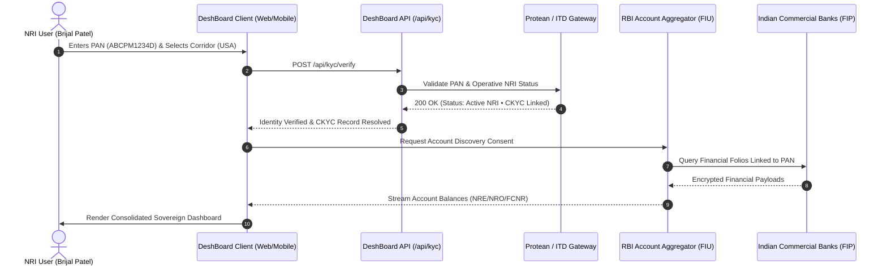

# DeshBoard: High-Level Architecture Design (HLD)
**System:** Sovereign NRI Wealth & Statutory Command Center  
**Version:** 1.0 (Production Architecture)  
**Author:** Engineering & Architecture Group  
**Classification:** Institutional Technical Whitepaper  

---

## 1. Executive Summary & Problem Space

Non-Resident Indians (NRIs) manage over **$150 Billion** in sovereign cross-border capital across bank accounts (NRE/NRO/FCNR), real estate holdings, demat portfolios, provident funds, and succession trusts in India. However, managing this wealth from jurisdictions like the United States (Silicon Valley), United Kingdom (London), and the United Arab Emirates (Dubai) is fundamentally broken:

1. **Fragmented Data Silos**: Asset registries are scattered across scheduled commercial banks, depositories (CDSL/NSDL), municipal corporations (MCGM, BBMP), and EPFO.
2. **Cross-Border Regulatory Friction**: Strict enforcement under US IRS (FATCA, FBAR Form 114, Form 8938), FEMA outward remittance limits ($1M USD/year via Form 15CA/15CB), and Indian Income Tax Section 195 withholding.
3. **Security & Trust Deficit**: NRIs are frequently exposed to cyber threats, physical property encroachment, and predatory financial brokers.

**DeshBoard** solves this by establishing a **read-only, zero-fund-movement sovereign command center**. It aggregates Indian assets, tracks cross-border liabilities, automates municipal tax actions, and delivers real-time statutory intelligence through verified government gateways.

---

## 2. High-Level Architecture Diagram

```mermaid
graph TB
    subgraph Client_Layer [1. Omnichannel Client Layer]
        Mobile["Responsive Mobile (iOS / Android Web)"]
        Tablet["Tablet Viewports (iPad / Surface)"]
        Desktop["Executive Desktop Workstations"]
    end

    subgraph Application_Tier [2. Next.js Sovereign Fullstack Engine]
        Gateway["Reverse Proxy & Edge Gateway\n(TLS 1.3, Rate Limiting, CORS)"]
        
        subgraph Frontend_App [Presentation & UI State]
            AppRouter["Next.js 14 App Router\n(Server & Client Components)"]
            StateStore["AppProvider State Engine\n(Active User Switcher, Multi-Currency INR/USD)"]
            VizEngine["Three.js / Globe.gl Engine\n(Sovereign Corridor Visualization)"]
        end

        subgraph Backend_APIs [Next.js Route Handlers]
            AuthAPI["/api/auth (Session & Multi-User Switch)"]
            AccountsAPI["/api/accounts (Sync & Redesignation)"]
            KycAPI["/api/kyc/verify (PAN & CKYCR Query)"]
            AiEngine["DeshBoard AI Intelligence Engine\n(DTAA, FEMA, Probate Rule Matrix)"]
        end
    end

    subgraph Integration_Middleware [3. Integration & Consent Middleware]
        AAGateway["RBI Account Aggregator Client\n(FIP / FIU End-to-End Encryption)"]
        AuthBridge["Protean / NSDL e-Gov Bridge\n(PAN Status, TRC Validation)"]
        DocEngine["Statutory Document & FBAR Generator\n(FinCEN 114, Form 15CA/CB, Sec 24b)"]
    end

    subgraph External_Networks [4. Indian Financial & Statutory Infrastructure]
        Banks["Scheduled Commercial Banks\n(SBI, HDFC, ICICI, Axis)"]
        Depositories["Demat Folios & Equity Escrow\n(NSDL, CDSL, MCA IEPF-5)"]
        Municipal["Municipal Corporations & Utilities\n(MCGM, Adani Power, Mahanagar Gas)"]
        TaxDept["Income Tax Dept & US IRS\n(ITD 2.0 Gateway, FinCEN E-File)"]
    end

    %% Flows
    Client_Layer -->|HTTPS / WSS| Gateway
    Gateway --> Frontend_App
    Frontend_App --> Backend_APIs
    Backend_APIs --> Integration_Middleware
    Integration_Middleware -->|Encrypted ISO 20022 / JSON| External_Networks
```



---

## 3. Core Architectural Pillars

### 3.1. Sovereign Zero-Fund-Movement Security
DeshBoard is architected strictly under a **zero-trust, read-only operational mandate**:
- **No Fund Movement**: DeshBoard does not ingest, store, or transmit transaction passwords, debit card PINs, or banking OTPs. It is technically impossible to initiate fund outflows through the platform.
- **256-Bit HSM Encryption**: All payload handshakes utilize hardware security module (HSM) backed 256-bit encryption.
- **DPDP Act 2023 & GDPR Compliance**: Full implementation of the *Digital Personal Data Protection Act (India)* and European GDPR. Consents are explicit, purpose-limited, time-bound, and support one-click data purge.

### 3.2. Multi-Profile Cross-Border Tenancy
DeshBoard natively models independent NRI family units and cross-jurisdictional tax profiles:
- **Brijal Patel**: Primary NRI (`San Jose, California, USA` • PAN `ABCPM1234D` • US Federal 37% + CA 13.3% Bracket • IRS Form 1116 Foreign Tax Credit).
- **Shagun Patel**: Independent NRI (`London, United Kingdom` • PAN `BCQPM5678E` • UK HMRC Remittance Basis).
- The `AppProvider` context handles instantaneous portfolio, account, and borrowing facility switches without state pollution.

### 3.3. RBI Account Aggregator (AA) Integration
Financial data consolidation avoids insecure screen-scraping:
- Connects directly as a **Financial Information User (FIU)** to RBI-licensed Account Aggregators (e.g., Setu, Anumati, OneMoney).
- End-to-end encrypted tokens bridge with **Financial Information Providers (FIPs)** across Indian banks to sync balance sheets, term deposits, and debt schedules.

---

## 4. Subsystem Decomposition

| Subsystem | Functional Scope | Key Technologies |
| :--- | :--- | :--- |
| **Command Center (Overview)** | Consolidated Indian net worth, dual-currency switcher (₹ INR / $ USD), Indian Wealth Health Index, urgent compliance alerts. | Next.js Server Components, Blade Design Tokens, Tailwind CSS |
| **Real Estate & Municipal Actions** | Title deed verification, indicative valuation, rental yield sync, and utility action tracker (Adani Power, MGL Gas, MCGM Property Tax). | Geospatial mapping, Municipal API webhooks, Lucide Institutional Icons |
| **Liabilities & Future Planning** | Cross-border borrowing facilities (HDFC NRI Home Loan), EMI autopay synchronization, Section 24(b) interest deduction certificates. | Financial amortization engines, debt-to-equity ratio matrix |
| **DeshBoard AI Intelligence** | Cross-border statutory advisor covering US-India DTAA Article 10, FEMA Form 15CA/15CB outward remittance, and Bombay High Court probate analysis. | Contextual Knowledge Retrieval, Statutory Citation Engine |
| **Compliance & FBAR Export** | Peak calendar-year account balance calculation, IRS Form 8938 threshold evaluation, one-click FinCEN Form 114 CSV generation. | Financial aggregation algorithms, Client-side CSV streaming |
| **3D Corridor Visualization** | Interactive WebGL globe rendering active repatriation corridors (San Jose, Dubai, London to India). | Three.js, Globe.gl, GeoJSON boundary projections |

---

## 5. Technology Stack & Component Specifications

```
├── Presentation Layer
│   ├── Framework: Next.js 14.2 (App Router with React 18)
│   ├── Styling: Tailwind CSS (Strict Institutional Palette: Navy #0D2266, Cobalt #3451D1, Slate #EAECF0)
│   ├── Typography: Inter (UI font), JetBrains Mono (Financial ledgers)
│   ├── Icons: Lucide React (Enterprise & Private Wealth icon sets)
│   └── 3D Graphics: Three.js & Globe.gl
│
├── Application & API Layer
│   ├── Runtime: Node.js 20 LTS / Edge Runtime
│   ├── API Routes: Next.js Route Handlers (`app/api/**`)
│   ├── State Engine: React Context API (`lib/store.tsx`) with localStorage hydration
│   └── Formatting: Custom INR / USD Currency and DateTime Formatters (`lib/formatters.ts`)
│
├── Deployment & Infrastructure
│   ├── Host: Cloud Run / Containerized Edge / Vercel Edge Network
│   ├── Web Server: Reverse Proxy with HTTP/2 and TLS 1.3
│   └── CI/CD: Automated Git Pipeline (`origin main`)
```

---

## 6. Data Flow Architecture

### 6.1. Verified Onboarding & PAN Query Pipeline
1. **User Input**: NRI selects host country (`USA`, `UAE`, or `UK`) and enters 10-character Indian PAN.
2. **ITD Gateway Query**: Handshake validates PAN authenticity against NSDL / Protean e-Gov database.
3. **Address & Identity Decryption**: Central KYC Records Registry (CKYCR) cross-references operative NRI status.
4. **Consent Request**: RBI AA protocol issues time-bound, digitally signed consent to the user's mobile device.
5. **Vault Activation**: Encrypted asset tokens populate the local session context; no master passwords are ever saved.



---

## 7. Security, Privacy & Compliance Controls

| Security Dimension | Implementation Standard |
| :--- | :--- |
| **Data Ingestion** | Read-only protocol via licensed RBI Account Aggregators. Zero credential storage. |
| **Transport Security** | TLS 1.3 strictly enforced with HSTS (HTTP Strict Transport Security) and perfect forward secrecy. |
| **Data Residency** | Indian user data cached in compliant domestic data centers in alignment with RBI Circular DPSS.CO.OD.No.2785/06.11.001/2017-18. |
| **Cross-Border Privacy** | DPDP Act 2023 compliant consent lifecycle. GDPR Article 17 "Right to Erasure" automated via 1-click purge. |
| **Monetization Policy** | **Zero Data Monetization**: User financial records are never sold, profiled for ad networks, or shared with third-party lead brokers. |

---

## 8. Non-Functional Requirements (NFRs)

1. **Performance & Latency**:
   - Initial Server Response (TTFB) $< 120\text{ ms}$ on edge nodes.
   - Core Web Vitals: LCP $< 1.2\text{ s}$, CLS $< 0.02$, FID $< 50\text{ ms}$.
2. **Cross-Device Responsiveness**:
   - Seamless fluid breakpoints across **Mobile Phones** ($320\text{px} - 640\text{px}$), **Tablets** ($768\text{px} - 1024\text{px}$), and **Desktop** ($> 1280\text{px}$).
   - Touch-optimized slide-out drawer on viewports $< 1024\text{px}$.
3. **Availability & Resilience**:
   - 99.95% availability target with multi-region failover.
   - Graceful offline fallback using cached portfolio snapshots.

---

## 9. Engineering Roadmap

- [x] **Phase 1**: Core 12-Module Unified Ledger, Multi-User Switching (Brijal & Shagun), and Real Estate utility tracking.
- [x] **Phase 2**: Loans & Liabilities planning module, Section 24(b) deduction engine, DeshBoard AI statutory counsel.
- [x] **Phase 3**: Responsive overhaul across all device form factors and 3-minute executive investor walkthrough.
- [ ] **Phase 4**: Automated FinCEN Form 114 Direct E-Filing pipeline via authorized IRS transmitters.
- [ ] **Phase 5**: 1-Click Form 15CA/15CB digital CA certification bridge to AD Category-I banks for instant repatriation.
